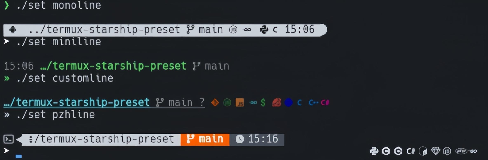

# 📦 termux-starship-preset
A minimal prompt preset for Starship in Termux. Focus: simple, fast, and clean.

## ✨ Preview



---

## ❕️ Prerequisites
- A [__Nerd Font__](https://www.nerdfonts.com/font-downloads) installed and enabled in your terminal

## ⚙️ Installation
```bash
apt update && apt upgrade -y
apt install git starship -y
git clone https://github.com/ZeltNamizake/termux-starship-preset
cd termux-starship-preset && chmod +x set
```

## 🚀 Usage
```
./set monoline
./set miniline
./set customline
```
